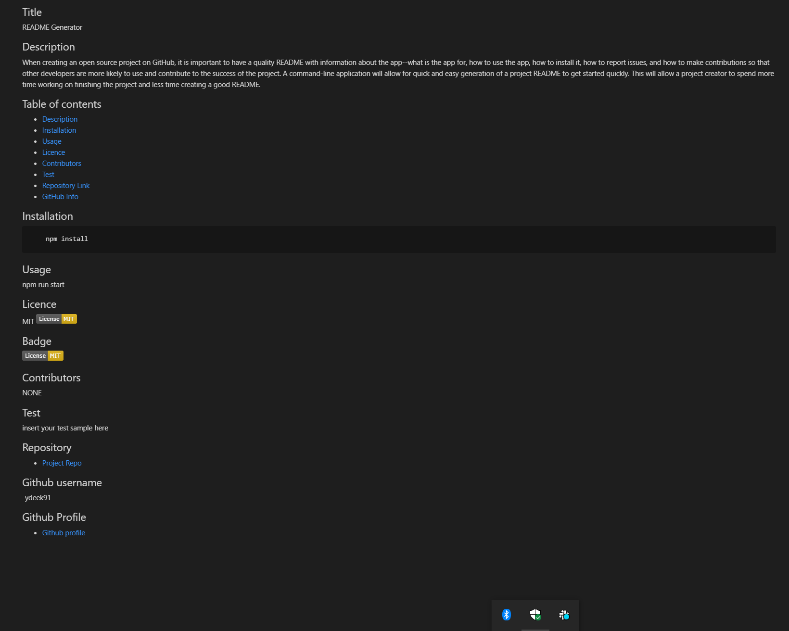

## Welcome to README Generator 

## Project Description: 
When creating an open source project on GitHub, it is important to have a quality README with information about the app--what is the app for, how to use the app, how to install it, how to report issues, and how to make contributions so that other developers are more likely to use and contribute to the success of the project. A command-line application will allow for quick and easy generation of a project README to get started quickly. This will allow a project creator to spend more time working on finishing the project and less time creating a good README.

## Installation
Step1: Run npm install
Step2: Rund node index.js

## Usage 
Rund node index.js 
Answer the questions

## Questions 
if you have any questions please contact ydeek91 on Github. 

## License 
MIT 
BSD

## Badges 

